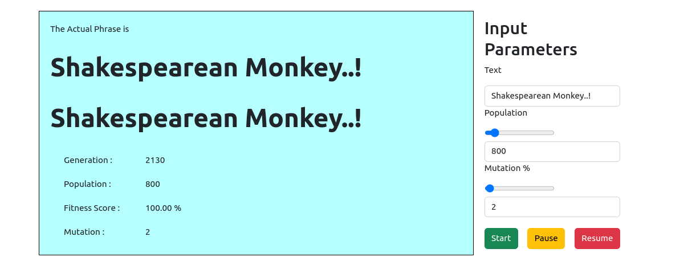
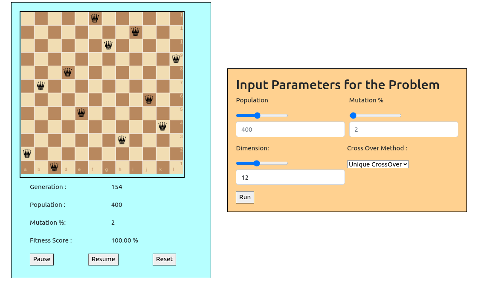

# Genetic_Algorithm
---

Collection of Codes which depicts the Working of Genetic Algorithm. All the codes have been generated using js So it could be accessed in the browser itself.

## Terminologies in Genetic Algorithm
---

* Fittness Function - This is the metric which defines which of the current population is fit or not. 
* Fitness Score - Determines how fit a given gnome sequence in a population is in comparision with the expected result
* Cross Over    - Process of getting data from two different gnome sequence to create a new sequence
* mutation      - A process where a ranomness is induced in the gnome sequence ( which is not already present in the current population)

## Shakespearean Monkey
---

When user provides the Exact text to be matched, the GA creates a population with random charecters (as genes). At every generation, it tries to check which of the population is more fit for next generation. The fitness function here is just the number of charecters matched between the current gnome sequence and the exact string. 

## n-Queens Problem
---

Solves the n-Queen problem on varying board sizes. The objective of this is to place n queens in a n*n board such that each queen does not interfere with any other queen on the board

### Fitness Function 

We cannot use a binary fitness function here ( coincides or not coinsides ) as it may increase our search space a lot. We need to quantify the level of collisons(queen positions) such that we can differentiate a nearly good position  to an worst position. This can accelerate our search speed rapidly. 

Here the worst position is when all queens collide with every other queen in the board (all in a straight line). So here the number of collisions will be `n*(n-1)`. So this can be used as a metric to define the quality of positions of queens in the board. 

$FitnessScore = 1.0 -  \frac{\text{Total No. of Collisions}}{n*(n-1)}$

### Cross Over Method
---

There are various cross over methods, that have been implemented as part of this GA code. However, Performing random cross over for this problem can result in  increasing  the existing search space. So here, we have used an unique crossover method such that it only crosses over the positions which are interfering with other queens. This ensures that the positions of other queens which are not interacting with the other positions can be fixed there by reducing the search time

Note : The use of this unique cross over function and the fitness function solves an 8*8 problem **10 times faster** than the normal methods