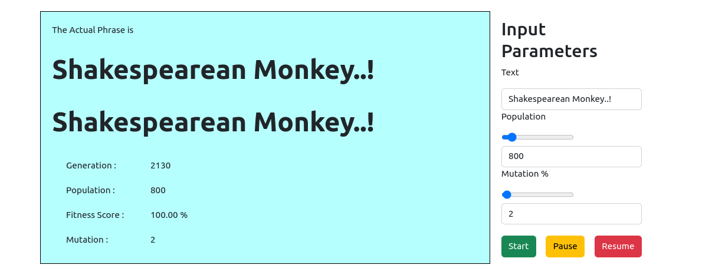

# Shakespearean Monkey
---

When user provides the Exact text to be matched, the GA creates a population with random charecters (as genes). At every generation, it tries to check which of the population is more fit for next generation. The fitness function here is just the number of charecters matched between the current gnome sequence and the exact string. 

